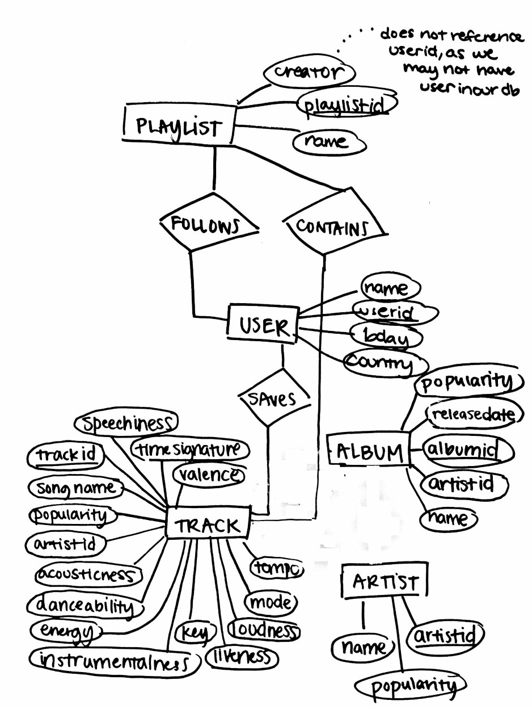

Musaic
=====================
Nikhil Vanderklaauw, Sarah Zhou, Luke Bauer, Zachary Liu, Emily Meng

[Try for Yourself on Heroku Here](https://sleepy-fjord-10699.herokuapp.com/ "Heroku Link")

## Introduction

Musaic is a Spotify analyzer application that allows users sign into their Spotify accounts to see interesting analyses about their music tastes, get song recommendations based on specified song attributes, and how they compare to other users in the database.

## Preview

## E/R Diagram

##Assumptions

A user can follow many playlists. A playlist can be followed by many users. A playlist can be created by one person. A user can save many tracks and a track can be saved by many users. Each track/album has attribute artistid that indicates they can be by only one artist. A playlist can contain many tracks and a track can be contained by many playlists. Each track is guaranteed to have one album and one artist it belongs to. 

## Descriptions

Albums(album_id, album_type, artist_id, genre, release_date, album_name, popularity)

* Each tuple represents an album
* artist_id indicates artist of the album (references artist)
 
Artists(artist_id, name, popularity, genre)

* Each tuple represents an artist 

Follows_Playlists(user_id, playlist_id)

* Each tuple represents one user following one playlist

Playlist_Contains(playlist_id, track_id)

* Each tuple represents one playlist containing one track 

Playlists(playlist_id, creator_id, playlist_name)

* Each tuple represents one playlist
* creator id indicates user id that created the playlist (does not reference User.user_id)

Saveds(user_id, track_id)

* Each tuple represents one user that saves one track
 
Spotify_Users(user_id, birthdate, country, name)

* Each tuple represents one user

Tracks(track_id, album_id, song_name, popularity, artist_id, acousticness, danceability, energy, key, liveness, loudness, mode, speechiness, tempo, time_signature, valence)

* Each tuple represents one track
* album_id represents album of track(references album)
* artist_id represents artist of track(references artist)

## To Run

### Windows:

1. unzip database files or git clone https://github.com/sarahzhou97/SpotifyApp.git
2. in \app\assets\javascripts\application.js remove the line 'require tree'
3. create a role in pgadmin corresponding to you (for me it was "zachary")
4. cd into the app
5. Run ‘gem bundle install’
6. Run 'rails s'
7. If there is an ssl error add the following:
	* Add to application.rb 
	* require 'openssl'
	* OpenSSL::SSL::VERIFY_PEER = OpenSSL::SSL::VERIFY_NONE
8. You also may need to change the pg_hba.conf file in your local installation of postgresql located at  \Postgresql\9.6\data. Where it says 'mdb' change to 'trust' 
9. Create Database: 'rake db:create'
10. Schema Migrations: 'rake db:migrate'
11. At this point the app should run on local server 'localhost:3000'
12. To deploy app, you need to push to heroku

### Mac:

1. unzip database files or git clone https://github.com/sarahzhou97/SpotifyApp.git
2. cd into the app
3. Run ‘bundle install’
4. Run 'rails s'
5. Create Database: 'rake db:create'
6. Schema Migrations: 'rake db:migrate'
7. At this point the app should run on local server 'localhost:3000'
8. To deploy app need to push to heroku

*Note: User must have Ruby, rbenv, postregesql, and Rails installed to run app. We recommend this resource: https://www.tutorialspoint.com/ruby-on-rails/rails-installation.html*

